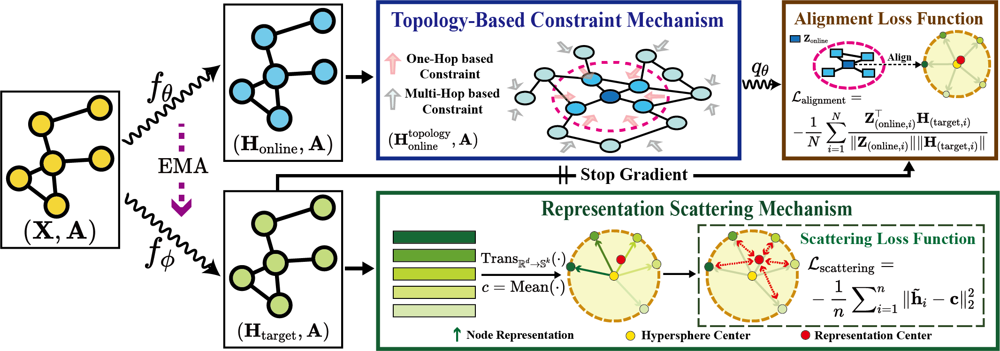

# SGRL_Pytorch
Official PyTorch implementation of **SGRL** in 'Exploitation of a Latent Mechanism in Graph Contrastive Learning: Representation Scattering' (NeurIPS 2024).

# 1. Environment Configurations
```plaintext
python==3.9.7
scikit-learn==1.4.2
scipy==1.13.0
networkx==3.2
numpy==1.26.4
torch==1.13.1
torch_geometric==2.3.0
tqdm==4.66.2
```

# 2. How to use SGRL

You can reproduce the results in the paper easily by running the command `bash run_{dataset_name}`.

# Cite
Please cite our paper if SGRL helps your work.

```
@article{he2024exploitation,
  title={Exploitation of a Latent Mechanism in Graph Contrastive Learning: Representation Scattering},
  author={Dongxiao He, Lianze Shan, Jitao Zhao, Hengrui Zhang, Zhen Wang, Weixiong Zhang},
  journal={NeurIPS},
  year={2024}
}
```


